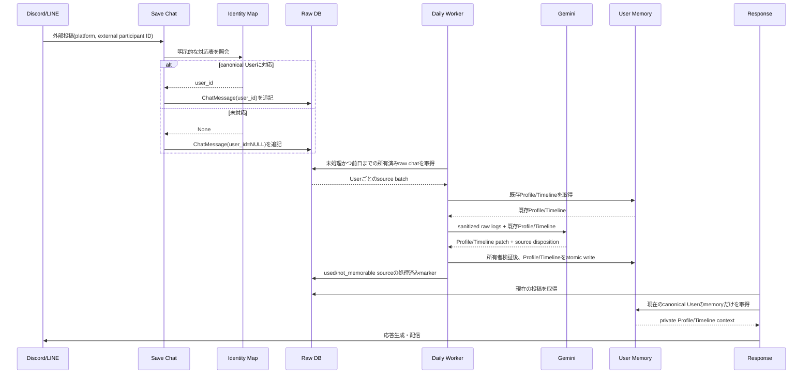

# ADR 0003: canonical User単位の長期記憶

- 日付: 2026-09-12
- 状態: 採用
- 関連: [ADR 0001](0001-chat-message-aggregate-and-conversation-scope.md)、
  [ADR 0002](0002-optional-character-responses.md)

## 決定

DiscordやLINEの外部参加者IDを、個人メモリの所有者として直接使わない。
`users`のcanonical Userを所有者とし、`user_channel_identities`で
`(platform, external_participant_id) -> user_id`を明示的に対応付ける。
対応付けがない投稿はraw chatとして保存するが、個人メモリの抽出対象にはしない。
異なる外部IDの自動統合、名前やメールアドレスによる推測、既存投稿の自動バックフィルは行わない。

raw chatを正本とし、ユーザーごとに次の2つのMarkdown投影を持つ。

- `Profile`: 長期間有効な事実、特性、好み、決定の短い要約
- `Timeline`: 特定日の意味のある出来事

受信処理ではLLMを呼ばず、`chat_messages.user_id`を確定させて追記する。
日次ワーカーが前日までの所有済みraw chatをまとめ、Geminiの構造化出力を検証してから
Markdownへ反映する。応答生成時は、現在の投稿のcanonical Userに対応するProfileと
Timelineだけを参考情報として読み込む。キャラクター単位の共有記憶は互換性のため残し、
ユーザー記憶へ自動変換しない。

## 必要性

- raw chatを残さないと、抽出誤りの監査、再抽出、記憶削除の根拠が失われる。
- canonical Userを持たないと、DiscordとLINEの同一人物を安全に統合できず、別人の記憶を混ぜる。
- 受信時に抽出しないと、投稿の応答遅延とLLM障害がチャット保存を巻き込む。
- ProfileとTimelineを分けないと、安定した好みと一時的な出来事の更新規則が混ざる。
- source markerがないと、ワーカー再実行で同じraw chatが重複投影される。
- 所有者検証と原子的な書込みがないと、別ユーザーのファイル混入や途中のMarkdownを読み込む。

## シーケンス



## データ境界

```text
users
  └─ user_channel_identities
       └─ chat_messages.user_id ──> memory/users/<canonical-user-id>/
                                      ├─ profile.md
                                      └─ timeline/<stable-id>.md
```

`memory_consolidated_chat_sources`は、抽出結果が適用された後に、
`used`または`not_memorable`と評価されたsourceだけを記録する。確信が持てない
`deferred` sourceはmarkerを付けず、次回の抽出で再評価する。

Geminiへ送るメモリ抽出payloadにはcanonical User ID、provider participant ID、
provider message IDを含めず、sourceを照合するための内部source IDだけを残す。
秘密、認証情報、健康・金融などのセンシティブな推定は保存しない。Geminiの構造化出力は
Pydantic schemaで検証し、source IDの全件評価とpatchの出典範囲をユースケースで再検証する。

## 運用

1. `uv run --frozen alembic upgrade head`で`chat_messages.user_id`、
   `user_channel_identities`、`memory_consolidated_chat_sources`を作成する。
2. `!users create <name> <email>`でcanonical Userを作成する。
3. 対応表へ、運用者が検証した外部IDだけを登録する。
4. `uv run --frozen --no-dev --extra ai start-worker`を1プロセス起動する。

既存のchat rowは安全のためNULLのまま残る。対応表を登録しても過去行へ自動で所有権を
付与しないため、バックフィルが必要な場合は対象IDを照合して個別に実施する。
ワーカーはDBのmarkerと安定したTimeline IDを使って再実行を許容するが、同時に複数プロセスを
起動しない。

## 今回の範囲外

Entity/Relationshipグラフ、ベクトル埋め込み、意味検索、記憶の減衰、Redis/arqなどの
キュー基盤、外部IDの自動名寄せは追加しない。必要になった時点で、raw sourceと
Profile/Timeline投影を壊さない別ADRで設計する。
