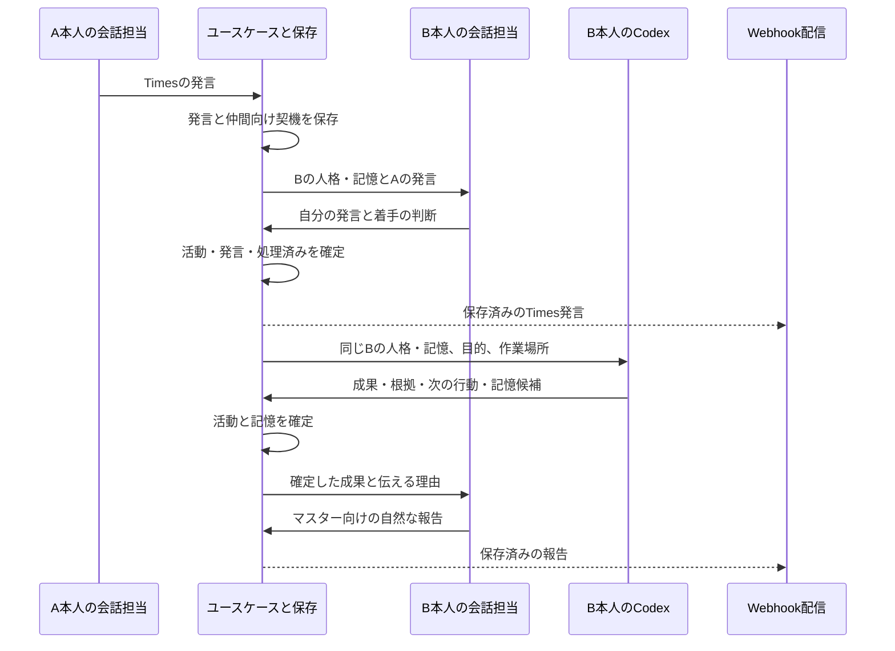

# メイド集団の実行設計

2026-09-13。状態: 実装前の設計案。
[要求分析](../plan/maid_collective_design.md)のU1〜U7とA1〜A13を具体化する。
製品の目的と要求は参照先を正本とし、本書では責務・データ・処理順・復旧を定義する。

初期構成は一人のマスター、一つのDiscordサーバー、一プロセス。
Timesとマスター向け会話の宛先は設定で区別する。
同じデータディレクトリを使う二重起動はOSのファイルロックで拒否する。
作業は全体で一件ずつ実行し、会話と配信は作業の終了を待たずに進める。
複数人の協力は順次の相談・分担から成立させ、並列作業基盤は追加しない。

## D1. 責務と境界

人格はキャラクターIDに属し、GeminiとCodexはその本人が使う能力とする。

| 担当 | 入力 → 出力 | 決めること／確定しないこと | 配置案 |
| --- | --- | --- | --- |
| 受信・起動 | Discord投稿、時刻 → 保存した契機 | 話者・宛先・重複の識別。仕事の意味は決めない | `presentation/bot`、起動ループ |
| 会話担当 | `CharacterContext` → `Decision` | 本人の発言、着手・変更・停止の意図、記憶候補 | Geminiアダプタ |
| 作業担当 | `WorkContext` → `WorkResult` | 本人として調査・制作・検証し、次の行動を判断 | Codex専用アダプタ |
| ユースケース | 判断・実行記録 → 活動・発言・記憶の更新 | 所有者、対象、版、達成根拠を検証し確定する | `usecases` |
| 保存 | 確定する更新 → 原子的なDB更新 | 記録・再開・入力の処理済み管理。支援価値を採点しない | SQLiteアダプタ |
| 作業環境 | 確定した記憶・案内 → 本人のファイル | 投影、参照先、読込み量、利用する道具の準備 | ワークスペースアダプタ |
| 配信 | 発言 → 断片案、保存済み断片 → 送信結果 | 宛先、名前・アイコン、分割、送信確認。文章の創作やDB更新はしない | Webhookアダプタ |

依存は入口 → ユースケース → ドメイン・契約。外部アダプタも契約に依存する。
DTOは`src/app/contracts/messages`、外部境界の関数・型は`src/app/contracts/ports`に置く。
会話担当には`converse(context) -> Decision`と`render(context, speech: Speech) -> str`を設ける。
通常会話は一回の`converse`で発言と意図を返し、Codexの結果を話すときだけ`render`を使う。
提供元を替えてもこの入力・出力と保存形式を保つ。二つ目の製品の先行実装はしない。
Codexは`run_codex(context) -> WorkResult`という専用の呼出し境界で扱い、汎用実行機構にしない。
Discordの入口では対象チャンネルの権限と
[Message Content Intent](https://docs.discord.com/developers/events/gateway#message-content-intent)を確認し、
メンションのない普段の発言も受け取る。

## D2. データと不変条件

SQLiteを活動・発言・原記録・確定した記憶の正本とする。
記憶本文はMarkdown文字列として保存し、本人のワークスペースにファイルとして投影する。
要求分析時の「Markdownファイルを記憶の正本にする」初期案は、この方式へ改める。
理由は、活動と記憶を一緒に確定し、ファイル書込みの失敗だけを再試行できるため。
[SQLiteの原子的コミット](https://www.sqlite.org/atomiccommit.html)を利用し、
DBの取引中にモデルやDiscordの応答を待たない。

| 記録 | 主な項目 | 不変条件 |
| --- | --- | --- |
| `CharacterState` | 本人ID、次回振り返り時刻、投影済みの記憶版一覧 | 人格設定は別の設定ファイル。モデル呼出しでIDを作り替えない |
| `Event` | ID、種別、話者・実行者、会話範囲、起点ID、順序、時刻、本文、出典、任意の活動ID | 人間の投稿がない契機も保存できる。外部投稿IDを一意にする |
| `Turn` | 本人、契機キー、起点ID、用途、処理レーン、状態、入力の版、試行、期限、出力、任意の活動ID | 同じ契機・本人・用途を二重に処理しない。反復の各回には別のキーを持つ |
| `Activity` | ID、目的、達成条件、担当、対象、状態、版、次の一手、再開条件、未回答の質問 | モデルの一回の実行と活動の達成を分ける |
| `Memory` | 所有者種別・ID、ノートID、本文、種別、出典、版、削除状態 | マスターの事情と本人の解釈を別の所有者にする |
| `MemorySource` | 所有者、原記録ID、抽出済み／再検討待ち | 抽出済みの確定は記憶更新と同じ取引。再実行で増殖させない |
| `Speech` | 本人、会話範囲、根拠、必要な相談、表現済み本文、元の活動の版、状態 | 生の作業出力を本文に代用しない。活動が無くても発言できる |
| `SpeechPart` | 発言ID、分割順、固定した宛先・本文、送信状態、試行時刻、Discord投稿ID | 発言IDと分割順が一意。送信を試みた本文は確認前に変更しない |

`Turn`の用途は会話、振り返り、作業、記憶整理、報告の表現。
状態は未処理、実行中、適用済み、再試行待ち、保留。用途ごとの別キュー製品は導入しない。
各記録のJSON本文は既存の型付きモデルで検証し、検索・一意性・版照合に使う項目だけDB列にする。

活動・発言・記憶への更新は、原記録と入力の処理済み状態とともに一取引で確定する。
実行結果の原記録は古い版に対する結果でも残すが、古い判断で現在の活動を上書きしない。
取引が失敗したら入力は未処理のまま。モデルの出力が保存済みなら適用をやり直し、
外部操作を伴う作業そのものを無条件にやり直さない。
会話の判断が旧版になった場合は原文と最新の文脈で再判断し、古い出力の適用を繰り返さない。

### 入出力の契約

- **`CharacterContext`:** 本人の人格、マスターの方針、本人とマスターの記憶、
  対象会話の履歴、関係する活動、今回の契機、現在時刻、各入力の版と省略範囲。
  活動はゼロ件でもよい。仲間には公開プロフィールと実際に共有された情報を使う。
- **`Decision`:** 任意の本人の発言、任意の活動変更一件、記憶更新候補、
  必要なら次に相談する仲間。話者IDと送信先URLはモデル出力から採用しない。
- **活動変更:** 開始は目的・期待する価値・対象・達成条件・次の一手、
  更新は活動ID・期待する版・変更内容、引継ぎは実在する受取人と根拠・残りを要求する。
- **`WorkContext`:** 上記の文脈に作業場所、資料・記憶の参照先、前回の実行結果を加える。
  振り返り用途では活動未登録でもCodexを起動できる。
- **`WorkResult`:** 実際の記録と成果参照、達成条件に対応する根拠、未完了事項、
  次の行動、記憶候補、伝える内容。話し言葉の最終報告はここから会話担当が作る。
- **報告の入力:** `render`には`CharacterContext`と、確定した成果・根拠・未確認事項・
  質問を保持する`Speech`を渡す。保存した結果だけを発言の事実として使う。

Geminiの出力形式は[構造化出力](https://ai.google.dev/gemini-api/docs/structured-output)を使う。
形式への適合だけでは仕事の有用性や達成を保証しないため、ユースケースで上記の条件を検証する。

## D3. 起動から仕事・会話へ

### 一プロセス内の実行ループ

受信処理とタイマーはユースケースを通じ、Eventと未処理Turnを同じ取引で保存する。
本人の指名・会話継続の判断は保存済みの話者から行い、未指定の新しい会話は候補を巡回する。
意味を理解した本人が必要な仲間へ会話をつなぐため、話者選定だけのモデルは増やさない。

会話系、作業系、配信の三つの非同期タスクを動かす。
会話系は会話・Geminiの振り返り・記憶整理・報告表現、作業系はCodexの振り返りと実作業を扱う。
各タスクは期限到来した未処理項目を順に取得し、DBで実行中へ変更してから外部処理を呼ぶ。
出力保存後、ユースケースが結果と処理済みを確定する。再試行には次回時刻と回数上限を持たせる。
上限に達した項目は理由付きで保留し、元の入力を残す。

作業系の消費タスクを一つに限定し、一実行の終了を待って次を取得する。
同じ取引で未終了の作業系Turnがないことを確認して取得するため、活動未登録の振り返りも排他対象になる。
再起動時の結果不明のTurnも、前の実行の終了を確認するまで枠を占有する。
非同期タスクを使っても、作業の直列化に加えて別の汎用ロック機構は増やさない。

### 契機と話者の選択

| 契機 | 次に行う処理 | 作業の登録が無い場合 |
| --- | --- | --- |
| マスターの通常発言 | 指名があれば本人、会話継続なら前の話者、新しい会話は候補を巡回する。本人が必要な仲間へつなぐ | 普通に話し、必要なら活動を作る |
| Timesの発言 | 指名された仲間、指定がなければ候補を巡回して本人の判断を呼ぶ | 本人は応答・沈黙・引受けを選べる |
| 振り返りの時刻 | 本人のGeminiによる振り返り、またはCodexで現状を確認する。対象の調査が必要なら後者へ渡す | 記憶と方針から新しい活動を作れる |
| 活動の再開条件 | 対応する回答・新情報・保存した再確認時刻を確認し、担当本人の作業を起動する | 対象活動を取り違えて新規作業にしない |
| 作業結果 | 活動を更新し、記憶整理・報告・本人または仲間の次の判断へ渡す | 発見から別の支援を始めてもよい |

振り返りは`CharacterState`に保持し、活動一覧が空でも起動する。
起動時に期限到来分を保存し、停止中に過ぎた周期は一回の振り返りにまとめる。
未処理の同じ本人の振り返りを重ねて作らない。起動間隔、実行期限、会話一巡の上限は
正の運用設定値として扱い、具体的な値は実業務に合わせて決める。

Timesでは一回のモデル呼出しを一人の発言・判断に対応させる。
発言を確定した取引で仲間向けの契機も一度保存し、配信とは独立して内輪の会話を続ける。
会話一巡の上限または全候補の沈黙でその巡回を終える。次の独立した振り返りは可能とする。
同じ起点IDの会話Turnを数え、沈黙も一回に含める。失敗の再試行で別の巡回を作らない。
仲間の人格を一度に読み込ませて全員の台詞や合意を代作する経路は使わない。

### 会話から本人が働く流れ（U2 → U4 → U5・U6）



本人の着手判断を適用できたときだけ「私がやる」という発言を採用する。
同じ契機から同じ本人への活動作成は一度とする。別々の気づきが意味的に重複する場合は、
現在の活動一覧を本人に渡して既存活動への参加・相談を選ばせる。文面の類似度だけで統合しない。
二人への分担はそれぞれの活動として持ち、元の相談を共通の出典にする。
活動未登録のCodexによる振り返りは読取りと提案までとし、対象の編集などは
活動の開始を保存してから行う。これにより再起動後も実作業の目的と担当を復元できる。

### 活動の遷移

| 現在 | 契機・判断 | 次の状態 | 必須の記録 |
| --- | --- | --- | --- |
| 未登録 | 本人が開始を選ぶ | `ready` | 目的、担当、達成条件、根拠 |
| `ready` | 作業枠を取得 | `running` | 入力の版と実行ID |
| `running` | 続行／引継ぎ | `ready` | 次の一手。引継ぎなら受取人と残り |
| `running` | 時間を置く | `sleeping` | 理由と再確認時刻 |
| `running` | 情報が不可欠 | `waiting` | 未回答の質問と質問を届ける発言 |
| `running` | 達成 | `done` | 各達成条件の根拠と結果 |
| `running` | 実行を継続できない | `blocked` | 失敗・予算等の理由と再開に必要な条件 |
| `sleeping`／`waiting`／`blocked` | 再開条件が成立 | `ready` | 条件の成立を示す入力・観測 |
| 未完了の活動 | 明確な停止 | `stopped` | 停止の原文と新しい版 |
| `stopped` | 明示的な再開 | `ready` | 現在の方針と再開の根拠 |

停止・重要な訂正は活動の版を先に進め、その後で実行中のCodexへ中断を要求する。
新しい作業枠は中断の確認後に開放する。中断を確認できない実行には新しい仕事を重ねない。
遅れて届いた古い結果は原記録に残すが、達成・次の仕事・古い約束の発言を確定させない。
単なる挨拶や相槌では活動の版を進めない。

再起動時の`running`は結果不明の実行として残し、前の実行の終了を確認してから
`ready`へ戻す。再開の最初に実ファイル・外部状態を確認する。
`done`の仕事に新しい目的が生じたら新規活動とし、完了の記録を上書きしない。

## D4. 記憶と文脈の組立て

初期の共有規則は、マスターの方針・Profile・Timelineを共通で読み、
キャラクター個人の経験・解釈は本人に渡す。仲間への共有は実際の会話・引継ぎを通す。
これは設計上の初期選択であり、直接参照の範囲を将来固定するものではない。

`build_context`は入力時点の原記録の順序と記憶の版を固定し、次を入力候補として組み立てる。

1. 本人の人格と、マスターの明示的な方針。
2. マスターと本人の確定した記憶の全本文。
3. 設定された会話範囲に属する履歴。時刻、話者、本人の発言、マスターに送信済みかを区別する。
4. 現在の活動、前回の結果、未回答の質問、今回の契機。

会話範囲の初期案は、同じマスターの登録済み対話チャンネルとTimes。
範囲は運用設定として明示する。候補は件数で先に切らず、容量に収まれば全量を渡す。
通常会話・振り返り・記憶整理・報告表現に同じ容量確認を適用する。

### 容量の確認と超過時の再試行

初期モデルは既存alignブランチと同じ`gemini-3.8-flash`とする。
[公式仕様](https://ai.google.dev/gemini-api/docs/models/gemini-3.8-flash)の
2026-09-13確認値は入力1,048,576、出力65,536トークン。
起動時とモデル変更時に[models.get](https://ai.google.dev/api/models)で上限を確認する。
入力予算は`B = 入力上限 - 出力予約 - 計数差の余裕`とする保守的な初期設計とし、
出力予約は設定する生成上限に合わせ、モデルの出力上限以内にする。
例えば最大出力65,536と余裕16,384を予約すれば、`B = 966,656`トークンになる。
これは予算の計算例であり、実際の入力を計数した結果ではない。

送信直前に、本文だけでなくシステム指示・話者情報・構造化出力のスキーマ・省略情報などを
含む実際のリクエスト一式を、同じモデルの[countTokens](https://ai.google.dev/api/tokens)で計数する。
モデル固有の計数はGeminiアダプタ、採否はユースケースが扱う。
起動時には必須部分、実装時の容量検証では想定する記憶・履歴・活動を含む入力一式を計数し、
内訳・合計・`B`との差を記録する。設定変更時にも再検証する。

容量を超えたら、次の優先度で低いものから発言・ノート単位で送信対象を減らし、再計数する。
関連性は活動ID・会話範囲・出典で判断し、同順位なら古いものから外す。選別用のモデルは増やさない。

| 優先度 | 入力の扱い |
| --- | --- |
| 必須 | 本人の人格・マスターの有効な方針、今回の指示と停止・訂正、対象活動・未回答の質問、指示の対象を特定する会話、判断・報告に必要な根拠と未確認事項 |
| 高 | 今回の会話・活動に関係する記憶と履歴（優先して保持） |
| 低 | その他の記憶・過去の会話・Timesの雑談・完了済み活動の詳細（優先して削減） |

質問と回答、訂正とその対象など、意味が変わる分断はしない。DBとMarkdownの正本・投影は削除しない。
Turnの試行ごとにモデル・上限・計数値・採用／省略した出典と理由を保存する。
省略範囲はモデルにも伝え、渡していない情報を「存在しない」と扱わせない。
記憶整理では実際に渡した出典だけを処理済みにし、省略した出典は次回へ残す。

事前計数を通ってもAPIが入力超過を返した場合は、低優先部分をさらに減らして再計数し、
同じTurn内で再試行する。再試行はD3の回数上限に従い、入力が減らないまま再送しない。
通信失敗やレート制限は入力超過と区別し、文脈削減の対象にしない。
低優先部分の削減で収まる超過は会話を継続し、必須部分だけでも収まらない場合に限り、
不足量を記録してその呼出しを保留する。
管理用停止と保存済み本文の配信は、モデル呼出しの保留に巻き込まない。

### 記憶の確定と投影

会話・作業から得る記憶候補には所有者、出典、更新前の版を付ける。
同じ所有者の候補は一組として版を検証する。
通常の候補は会話・作業の確定時に適用する。独立した記憶整理Turnは、
競合した候補と、まだ抽出していない原記録をまとめて処理するために使う。
本人の解釈をマスターの確定事実として保存せず、明示的な訂正を優先する。
記憶の版だけが競合した場合は候補を再検討待ちにし、確認済みの作業結果まで捨てない。
候補はTurnの出力に残し、その出典を抽出済みにはしない。
記憶整理は未処理の出典をまとめて会話モデルへ渡し、適用または記憶不要を確定する。

DB確定後、削除も含めて本人用Markdownへ投影する。失敗した所有者だけを再投影する。
作業実行中はその実行が読む投影を更新せず、作業の合間に更新する。
投影の全ファイルが確定版に揃ったことを確認してから次のCodexを起動する。
会話はDBの最新の文脈を読める。作業は入力時点の版を使い、重要な訂正はD3の中断・再開で反映する。
Codexのセッション履歴を人格・記憶・活動の正本にはしない。

## D5. 本人の作業場所とAGY

```text
data/
  collective.sqlite
  characters/<本人ID>.json
  master.md
  work/<本人ID>/
    AGENTS.md
    memory/             確定した本人記憶の投影
    master/             共通の方針・記憶の投影
    repos/              ghqで取得する本人の作業ツリー
    tasks/<活動ID>/     作業資料・成果
    runs/<実行ID>/      入力の版・参照先・実行記録
```

Codexは`work/<本人ID>/`を起点として、実行ごとに新しいセッションを開始する初期設計とする。
継続はモデル外の記録から復元する。活動の無い振り返りにも実行IDを発行する。
対象リポジトリの規約は編集前に読み、取得には`ghq get`を使う。
成果本体は本人のファイルとして保持し、DBには所在と検証の根拠を保存する。

`AGENTS.md`は人格・記憶・資料・道具の場所を案内する。現在の全タスクを転記しない。
本人は必要な追記・削除を差分として提案し、保存側が参照先と読込み量を確認する。
必須の参照は短い固定の案内として残し、長くなった説明は別ファイルへ移して添削する。
読込み予算は他の案内を含む合計バイト数で確認し、超える案内のまま次の実行を始めない。
読み込みの起点と更新時点は[AGENTS.md公式仕様](https://learn.chatgpt.com/docs/agent-configuration/agents-md)に従う。

Codex専用アダプタはApp Serverの実行IDを記録し、開始・結果・中断を追跡する。
文章作成・添削を行う本人にはAGYの`SKILL.md`を読ませ、Antigravity CLIを呼べる環境を渡す。
スキルの存在、CLIの起動、必要な認証・通信を実際の実行環境で確認する。
共有の認証値は記憶・入力本文・成果へ入れず、実行環境から利用する。
AGYの結果は本人が確認し、スキルを使っただけで完了にしない。
[App Server公式仕様](https://learn.chatgpt.com/docs/app-server)の`turn/start`・`turn/interrupt`と
スキル入力を参照する。Codexの中断後も子プロセスの終了を確認してから作業枠を開放する。

## D6. 成果の表現と配信

マスター向けの`Speech`には、できたこと、分かったこと、根拠、未確認事項、必要な質問を保存する。
会話担当は本人の人格・記憶とこれらの事実から自然な本文を作る。
Times用の文脈を報告用に流用して、内輪の会話をマスター向けの演出に変えない。
配信アダプタの分割処理が断片案を返し、ユースケースが全断片を一括保存する。
実際の送信は保存した断片だけを使い、配信アダプタからDBを更新しない。

| 状態 | 処理 | 失敗・競合時 |
| --- | --- | --- |
| `unrendered` | 会話担当が本文を作る | 生成失敗はこの状態で再試行を予約。Codexの生出力で代用しない |
| `ready` | 未送信の本文を必要なら意味の切れ目で分割し、各宛先を固定 | 活動の版が変わっていれば最新の結果から再表現してから送る |
| `sending` | 各断片の試行を先に保存し、Webhookを呼ぶ | 応答が不明なら`unknown`。固定した本文を変更しない |
| `sent` | Discord投稿IDと確認結果を保存 | 全断片の確認後に発言全体を送信済みにする |
| `unknown` | 保存済みの投稿IDがあれば照合 | 投稿IDも不明なら本文一致だけで成功や未送信を断定せず、管理用の確認対象に残す |

各投稿に本人の名前とアイコンを指定し、`wait=true`で確認結果を取得する。
一投稿の本文上限は2000文字。本文だけで結果を理解できる短い報告を基本にし、
必要なら成果へのリンクや個別ファイルを添える。
[Webhook公式仕様](https://docs.discord.com/developers/resources/webhook#execute-webhook)。

宛先ごとに順番を守り、成否不明の断片より後を先に送らない。他の宛先や作業は続けられる。
確実に拒否された送信は設定や待機条件の修正後に再試行する。
送信アダプタは一試行一POSTとし、通信層に成否不明のPOSTを自動再送させない。
成否不明なら自動再送を保留する。本文へ管理IDを露出する照合用の表示は追加しない。
投稿IDが既知でも、投稿の消失だけを理由に未送信と判断して再送しない。
Discord送信とDB保存を一つの取引にはできないため、外部配信の厳密な一回実行は保証しない。

自己Webhookの反響はWebhook IDと投稿IDで識別し、新しい人間の入力として処理しない。
仲間の応答はD3で保存した内部の契機から進むので、反響の除外でTimesが止まることはない。
マスターに未送信の内容は、対話文脈でも伝達済みとして扱わない。
管理用の状態確認・停止・配信確認はBotから応答できるが、日常の会話や成果の代替経路には使わない。

## D7. 検証と実装への引継ぎ

| 受入条件 | この設計で追加して検証する境界 |
| --- | --- |
| A1 | 活動ゼロ・人間の投稿ゼロでも振り返りのTurnが作られ、Gemini起点とCodex起点の両方で活動を作れる |
| A2 | 各人の入力に本人だけの経験が入り、別の人の発言・引受けが別の判断として保存される。雑談・沈黙でも終了できる |
| A3 | 停止を保存した後に旧版の実行結果が返っても新しい仕事を始めず、挨拶は作業の版を変えない |
| A4 | 作業の外部操作直後、結果保存直前、確定直後でそれぞれ中断し、現状確認から再開する |
| A5 | 記憶の確定後・投影前に中断しても同じ版を再投影できる。競合した記憶候補だけを再検討し、作業の成果を失わない |
| A6 | 案内の移動・削除・上限超過を検出し、必須参照と合計予算を保った案内で次の実行を開始する |
| A7 | キャラクターの実環境でAGYを起動し、返答と失敗を記録する。中断した子プロセスの残存も確認する |
| A8 | 内部の発言を一度だけ仲間へ渡し、Webhookの反響を何度受けても活動・会話を重複させない |
| A9 | 本文だけで成果が分かり、必要な根拠を参照できることを実際のスマートフォンで確認する |
| A10 | 生成失敗、送信前失敗、送信後の確認喪失、長文の途中失敗を区別し、再実行・重複・順序逆転を防ぐ |
| A11 | 検証用の会話担当へ差し替えて、同じ人格・記憶・活動から通常会話と報告を再開する |
| A12 | 各用途で入力予算の直前・一致・超過、モデル変更、事前計数後のAPI超過を検証する。低優先部分を減らして再試行し、停止・訂正・質問の対象と原記録を保つ。必須部分だけの超過は保留、省略した記憶整理の出典は未処理となる。内訳・合計・残容量を確認する |
| A13 | 実業務の同じ範囲で、人の依頼・説明・監督・確認・手直しを含めた負担を比較する |

実装はU2→U4→U6の一つの仕事を通した後、U3の自発起動、U5の継続、U1の訂正・停止、
U7の環境整備を同じ流れへ加える。文書上の検証条件を実装の成功実績として扱わない。

既存コードの再利用は、`autonomous-collective`の活動・原子的な保存・作業場所を土台候補とし、
`align-ai-maid-definitions`の人格定義・Profile/Timeline・原記録の出典管理を組み合わせる。
活動を必須とする会話入力、全員の台詞を一度に作るTimes、Skills禁止、
Gemini失敗時の直接送信、ZIP中心の報告は、この契約に合わせて置き換える。
既存DBや作業場所の移行は、稼働中データの有無を確認してから別途手順を定める。

### 必要性と過不足

- D1の責務分担が無いと、本人の継続性と会話担当の交換が作業の接続方式に巻き込まれる（G2・G3）。
- D2の一意性・版・原子的な確定が無いと、再試行で仕事や記憶を増やし、管理負担を戻す（G1・G2）。
- D3の活動から独立した契機が無いと、依頼待ちから抜けられない（G1）。本人別の判断が無いと掛け合いが作業の分担につながらない（G3）。
- D4の共通の正本と版を持つ投影が無いと、会話と作業で異なる記憶を事実として扱う（G2）。
- D4の事前計数と優先度が無いと、履歴の増加で会話が止まり、停止・訂正まで失う（G2・G4）。
- D5の継続的な場所・案内・道具の接続が無いと、毎回の探索と環境説明が必要になる（G2）。
- D6の表現と配信の保存が無いと、マスターが生の成果を読み解き、送信失敗の後始末をする（G4）。

分散実行、汎用の実行エンジン、常設の司令塔、意味検索、別の人物の私的記憶の自動共有は追加しない。
業務例・実行頻度と予算・会話履歴の範囲は、要求分析の未確定事項を引き継ぐ。
容量の計算例を実業務の入力一式による実測へ置き換え、省略後の判断の正しさもA12で確認する。
