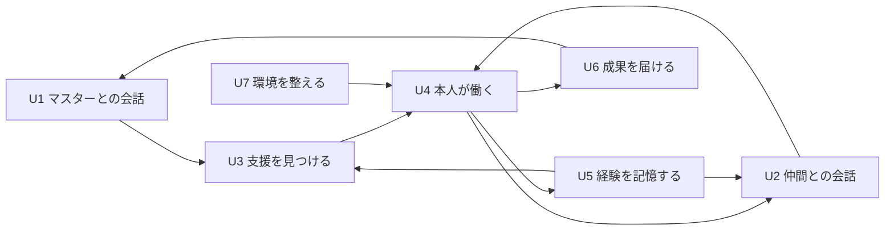

# 自律的なメイド集団の要求分析とユースケース設計

2026-09-13。状態: 要求分析・基本設計案。今回の対話を要求の根拠とする。
目的 → 要求 → 振る舞い → 実現方法 → 受入条件 → 不足・過剰の順に定義する。
受入条件は今後の実装に対する条件であり、実装済み・検証済みを示すものではない。
現行mainのテンプレートと過去のAI機能分離方針は履歴として扱い、
この構想の採用によって既存実装やデータを自動的に削除・移行しない。

## 1. 目的と価値

**G0: マスターを継続して理解し、複数の個性を持つメイドが自ら考え、
協力して働くことで、マスターの業務負担を減らす。**

減らしたい負担には、作業自体に加え、依頼の組み立て、事情の再説明、
進行の管理、成果の確認、誤りの手直しを含める。

| 目標 | マスターに生まれる価値 | 価値を確認する観点 |
| --- | --- | --- |
| G1 先回りして実行する | 一手ずつ依頼せずに必要な準備が進む | 未依頼の支援が実際に役立ったか |
| G2 理解と活動を継続する | 同じ説明や再開指示を繰り返さずに済む | 過去の事情・訂正・作業結果が次の行動に活きたか |
| G3 個性と掛け合いを活かす | 異なる観点から支援を受けられ、仲間の文化が育つ | 各人の視点が会話や具体的な仕事に反映されたか |
| G4 自然に関わり、成果を受け取れる | 操作方法を覚えず、必要な結果をその場で理解できる | 会話と成果確認が新たな負担になっていないか |

発言数・生成物数・稼働時間を成功指標にしない。
Timesでの雑談や関係性にも価値があり、すべての会話に仕事の創出を求めない。
G0は機能テストだけでは判定できないため、実際の業務でA13の価値確認を行う。

## 2. 何ができるべきか

ここでは製品名、通信手段、保存形式を要求に含めない。
H1〜H8は、対話で示された思想から導く能力である。

- **H1 状況を理解し、記憶を更新できる（G1・G2）。**
  マスターの事情、本人の経験、会話履歴を使い、事実と解釈を分けて訂正を反映する。
  無いと、同じ説明を繰り返させ、古い理解に基づく仕事を増やす。
- **H2 支援の機会を自ら見つけられる（G1）。**
  会話、記憶、作業中の発見から次の行動を選べる。新しい依頼や作業登録を必須にしない。
  無いと、マスターが支援の必要性と手順を毎回言語化する負担が残る。
- **H3 実行し、確かめ、必要なら続きを進められる（G1・G2）。**
  達成したことと未完了事項を区別し、待機・再開・方針変更・終了を判断する。
  無いと、会話上の約束で止まるか、マスターが進行管理を引き受ける。
- **H4 仲間がそれぞれの個性で交流し、協力できる（G3）。**
  自由に話し、異なる見方を出し、必要なら分担・相談・引継ぎを行う。
  無いと、複数キャラクターが見た目だけの違いになり、観点の幅と文化が失われる。
- **H5 同じ本人として会話と作業を続けられる（G2・G3）。**
  会話時と作業時で人格・本人の記憶・活動の所在を引き継ぐ。
  無いと、「私がやる」と話した本人と、実際に働く担当の理解が分断される。
- **H6 普段の言葉で関われる（G2・G4）。**
  雑談・依頼・追加情報・訂正・停止を受け取り、活動に関係する意思を反映する。
  無いと、専用操作の習得や、作業への指示の言い直しが必要になる。
- **H7 利用できる成果を分かる形で届けられる（G1・G4）。**
  何ができ、何が分かり、何が未確認かを、本人の自然な言葉で伝える。
  無いと、マスターが生の作業記録や添付を読み解き、結果を再構成することになる。
- **H8 自分の作業環境を把握し、使える道具を活用できる（G2）。**
  記憶・資料・成果・道具の所在を知り、その案内を現在の状態に保つ。
  無いと、毎回の探索や環境説明が必要になり、使えるはずの能力も失われる。

## 3. ユースケースと具体的な振る舞い

行動主体はキャラクター本人。マスターは支援を受ける人であり、
運用者は接続や管理を担う役割とする。同じ人が両方を担ってよい。
「活動」は一つの支援目的に向かう仕事、「原記録」は実際の発言・観測・実行結果、
「記憶」は原記録から整理した訂正可能な理解・経験を指す。

### U1 会話を受け取り、状況と意思を理解する

対応: H1・H5・H6。主体: マスターとキャラクター。
前提: 会話相手を識別できる。契機: 挨拶、相談、依頼、訂正、停止などの発言。

1. 本人の人格・記憶とマスターの状況を踏まえて発言を理解する。
2. 自分の考えを返す。作業に関係する意思は対象の活動へ反映する。
3. 後の会話や作業にも使える事情・訂正をU5へ渡す。

結果: 会話と活動の両方に意思が届く。
挨拶だけで進行中の仕事をやり直さない。対象が曖昧な停止などは確認し、
確認できていない操作を実行済みとは返さない。

### U2 Timesで自由に話し、必要なら協力へつなげる

対応: H2・H4・H5。主体: 複数のキャラクター。
前提: 各人の個性と記憶がある。契機: 本人の関心、思い出、仲間の発言や作業中の発見。

1. 一人が自分の視点から話す。仲間は各自の視点で応じるか、応じずに過ごす。
2. 役立つ仕事に気づいた本人が「私がやっておく」と引き受け、U4へ進む。
3. 仲間の観点が必要なら相談し、目的・分かったこと・残りを共有する。

結果: 自由な会話と関係性が続き、必要なときに本人たちの仕事につながる。
仕事を作らず雑談で終わってもよい。全員の参加や合意を必須にしない。
他人の判断・発言・実行結果を一人が創作しただけでは協力の成立としない。

Times自体が内輪の場であり、キャラクターはマスターの目を意識せず話す。
マスターは見て見ぬふりをする。これは会話上の関係であり、
マスターを技術的に閲覧不能にする要求ではない。

### U3 記憶や現状から、先に取り組むことを見つける

対応: H1・H2・H3。主体: キャラクター。
前提: マスターの事情や支援対象を理解できる。登録済みの活動は無くてもよい。
契機: 状況を振り返る機会、再確認の時期、作業中の新しい発見。

1. 記憶、現在の状況、仲間や自分が進めている仕事を確認する。
2. 期待する価値と確かめる結果を考え、具体的な一手を選ぶ。
3. 自分で着手するか、仲間に相談するか、今は動かないかを決める。

結果: 人間の新しい発言がなくても支援が始まる。
重複する仕事や根拠の薄い思いつきは見直す。判断に不可欠な情報だけが不足する場合は、
分かる範囲の作業を進めたうえでマスターに確認する。

### U4 本人が手を動かし、確かめ、続きを管理する

対応: H3・H4・H5・H6。主体: 担当キャラクター、必要に応じて仲間。
前提: 目的・担当・期待する結果が分かる。契機: 引受け、依頼、待機条件の成立。

1. 自分の作業場所と前回の結果を確認し、調査・制作・検証などを行う。
2. 結果を目的と照合し、達成・継続・待機・質問・引継ぎ・停止を判断する。
3. 成果、未完了事項、再開の条件を残す。経験はU5、伝える内容はU6へ渡す。

結果: マスターが進行を管理しなくても仕事が続き、達成した根拠が残る。
処理の終了だけで達成にしない。中断後は実際の状態を確認して再開する。
訂正・停止が届けば以降の判断に反映し、既に行った操作まで取り消したとは言わない。

### U5 経験を記憶し、次の会話と作業に活かす

対応: H1・H5。主体: 経験・発言・訂正を受け取ったキャラクター。
前提: 原記録とその話者・実行者が分かる。契機: 会話、作業結果、訂正。

1. 今後役立つ事情や経験を整理し、事実・本人の解釈・未確認を区別する。
2. マスターに関する情報と本人の経験を、それぞれの所有者に結びつけて更新する。
3. 次の会話・判断・作業で読み直し、必要なら原記録へ戻る。

結果: 同じ本人が、話すときにも働くときにも経験を活かせる。
訂正後は古い理解を確定事実として使わず、別の人物の記憶を上書きしない。

### U6 マスターに成果と必要な相談を届ける

対応: H6・H7。主体: 報告するキャラクターとマスター。
前提: 伝える成果や確認事項がある。契機: 意味のある進展、完了、質問、状況確認。

1. できたこと、得られた知見、未確認事項から、マスターに必要な内容を選ぶ。
2. 本人の自然な話し言葉で伝え、必要な成果や根拠を参照できるようにする。
3. 返答があれば活動と記憶へ反映する。

結果: スマートフォンでも本文で成果を理解でき、次にどう使えるかが分かる。
Timesの全会話や生の実行ログを読ませない。ZIPの展開を成果理解の前提にしない。
伝達に失敗しても作業成果を残し、報告のために同じ仕事を再実行しない。

### U7 自分の作業環境と案内を整える

対応: H5・H8。主体: キャラクター。
前提: 本人の継続的な作業場所がある。契機: 作業開始、資料や道具の追加・移動・削除。

1. 自分の記憶、資料、成果、使える道具の所在を確認する。
2. 変化した案内を更新し、長くなれば必要な参照先を保って短くする。
3. 作業に必要な道具を使い、結果を確認する。

結果: 次回も本人が迷わず作業を続けられる。
道具が使えない場合は実行失敗として扱い、成功したことにしない。

## 4. 実現方法

### 対話で指定された制約

これらはH1〜H8から一意に決まる技術ではなく、マスターが選んだ実現上の方針である。

- **C1:** 人間との会話・成果報告には必ず会話モデルを介する。
  現在は自然な日本語表現を理由にGeminiを、作業への組込みやすさを理由にCodexを選ぶ。
  会話担当は交換可能にする。Codexを作業担当とし、交換用の汎用実行基盤は作らない。
- **C2:** 会話APIには人格、マスターと本人のコンテキスト・記憶、会話ログを全量候補として用意する。
  使用モデルの入力上限と送信内容全体のトークン数を照合し、収まれば全量を渡す。
  超過時は優先度の低い部分から送信対象を減らし、再計数して再試行する。
  現在の指示・停止・訂正と判断に不可欠な文脈を残し、原記録と記憶の正本は削除しない。
  Codexも同じ本人の記憶を読めるようにする。
- **C3:** キャラクターごとに一つの継続的なワークスペースを持つ。
  `AGENTS.md`の案内を更新・添削し、CodexからAGYスキルを利用可能にする。
- **C4:** DiscordのサーバーにBotは一台。Botを目と耳、Webhookを口にし、
  名前とアイコンをキャラクターごとに指定する。管理用応答はBot発言の例外にできる。
- **C5:** 普段の入口に`!work`などの専用コマンドを要求せず、
  成果の理解にZIPのダウンロード・展開を要求しない。

### 実現要素の対応

責務、入出力、データ、状態遷移、復旧の具体設計は
[実行設計](../architecture/maid_collective_runtime.md)にまとめる。

| 要素 | 対応するユースケース・制約 | 実行設計での具体化 |
| --- | --- | --- |
| T1 人格を共有した会話・作業の境界 | U1〜U6、C1・C2 | D1の責務とD2の入出力。GeminiとCodexは同じ本人の能力として接続する |
| T2 人間の発言に依存しない実行と継続 | U2〜U4 | D3の活動とは独立した契機、本人別の判断、状態遷移 |
| T3 所有者と原記録を持つ記憶 | U1・U3・U5、C2 | D2・D4のDBでの確定とMarkdownへの投影。会話と作業は同じ正本から入力時点の版を読む |
| T4 本人のワークスペースと道具 | U4・U7、C3 | D5の固定した作業場所、短い案内、AGYの実行環境 |
| T5 発言の文脈と配信 | U1・U2・U6、C1・C4・C5 | D6の本人の表現、Webhook、分割と送信確認 |

記憶は活動と同じDBで確定し、Markdownは本人が読む投影へ変更する。
これにより、活動の更新後に記憶ファイルの書込みだけが失敗しても復旧できる。
マスターの共有記憶と本人の経験を分け、Geminiへの入力はC2の容量確認と優先度に従う。

### 実現要素が無いと何が困るか

- T1の共通人格・記憶と会話の境界が無いと、本人の継続性と会話担当の交換可能性を失う。
- T2の自発的な起動・活動保存・更新の調停が無いと、依頼待ち、失念、二重作業が起きる。
- T3の所有者・原記録・訂正可能な記憶が無いと、誤った理解を引き継ぎ、説明負担を戻す。
- T4の継続的な場所・短い案内・道具への接続が無いと、本人が記憶や作業能力に到達できない。
- T5の発言文脈・Webhook・配信記録が無いと、Timesの関係性、話者の識別、負担の少ない成果受領を保てない。

## 5. 受入条件

以下は実装時に確かめるシナリオ。経路・状態・重複処理はテスト用の会話担当・作業担当で検証し、
人格、日本語の自然さ、仕事の有用性は実際のモデルとマスターによる確認も行う。

| ID | 前提・操作 | 観測できる合格条件 | 対応 |
| --- | --- | --- | --- |
| A1 | 支援対象と過去の事情があり、活動も人間の新規投稿もない状態で振り返る | 本人が理由のある準備を選び、活動を作って着手する。専用の作業登録を求めない | U3・U4、H1〜H3 |
| A2 | 二人の異なる人格・記憶でTimesの話題に参加する | マスターを観客としない入力で各人が発言し、一人の気づきから他方が引き受けて働ける。雑談で終える場合も許容する | U2・U4、H2・H4・H5 |
| A3 | 作業中に挨拶、訂正、明確な停止を順に通常の文章で送る | 挨拶で仕事を再実行せず、訂正が次の判断へ届き、停止後は新しい作業に着手しない。コマンド入力は不要 | U1・U4、H6、C5 |
| A4 | 待機中と実行中のそれぞれで再起動する | 目的・担当・未完了事項を復元し、条件成立または実際の状態の確認後に続ける。処理終了を成果達成と取り違えない | U4、H3 |
| A5 | ある出来事とその訂正を記憶し、会話・作業を新しい実行で開始する | 両方が訂正後の事情と本人の経験を使う。出典をたどれ、他人の記憶を上書きせず、再処理で同じ記憶を増殖させない | U1・U5、H1・H5、C2 |
| A6 | 同じ本人が別の仕事を始め、資料を移動・削除し、案内が読込み予算を超える | 同じワークスペースを使う。案内が更新・添削され、必須の参照と実際の合計上限を守り、次回起動で有効になる | U7、H8、C3 |
| A7 | 本人の作業環境でAGYによる文章の添削を行う | スキルを読みCLIを実行でき、返った文章を確認して作業へ利用する。実行失敗を成功として記録しない | U4・U7、H8、C3 |
| A8 | 二人がTimesとマスター向けに発言し、Webhookの反響を再受信する | Botは一台で、各人の名前・アイコンを持つWebhook投稿になる。各発言の処理は一度で、仲間の意図的な返答は続けられる | U1・U2・U6、H4・H6、C4 |
| A9 | 調査・制作が完了し、スマートフォンで報告本文だけを読む | できたこと・得た知見・未確認事項が分かる。根拠と矛盾する成果を主張せず、ZIP展開や全ログ読解を要求しない | U6、H7、C1・C5 |
| A10 | Geminiの生成失敗とWebhookの配信失敗を別々に起こす | 生出力やBot送信で代替しない。成果と未配信の状態を残し、作業を繰り返さず報告を復旧する。成否不明で投稿IDがあれば照合し、IDも不明なら自動再送せず保留する | U6、H3・H7、C1・C4 |
| A11 | 会話担当を同じ契約の別実装に差し替える | 人格・記憶・活動の保存形式とユースケースを変えずに会話を再開できる。検証用実装で境界を確かめ、第二の製品実装は必須にしない | U1・U5・U6、H5、C1 |
| A12 | 使用モデルの上限を取得し、入力一式の上限内・超過とAPIからの超過エラーを用意する | 送信内容全体を計数し、収まれば全量を渡す。超過時は低優先部分から減らして再計数・再試行し、停止・訂正を扱える。必須部分のみの超過は保留し、省略した記憶整理の出典は未処理とする。省略範囲を記録し、同じ過大入力を再送せず、原記録を保持する | U1・U5、H1・H5、C2 |
| A13 | 実際の一業務について、人が行う場合と支援を受ける場合を比較する | 依頼・説明・監督・確認・手直しを含む負担が減り、成果が役立ったとマスターが判断する | G0〜G4 |

実業務が未確定なため、A13の暫定例は「過去の会話から必要と分かる比較調査を先に行い、
仲間の別の観点も確かめ、判断に使える要点を届ける」とする。
同じ作業範囲で時間・介入回数・有用性を記録し、実業務の基準に照らして評価する。

## 6. 目的との対応から不足と過剰を確認する

### 追跡表

| 目的 | 必要な能力 | 主なユースケース | 実現要素 | 確認条件 |
| --- | --- | --- | --- | --- |
| G1 先回りと実行 | H1・H2・H3・H7 | U2・U3・U4・U6 | T1・T2・T3・T5 | A1・A2・A4・A9・A13 |
| G2 理解と活動の継続 | H1・H3・H5・H6・H8 | U1・U4・U5・U7 | T1〜T4 | A3〜A7・A11・A12・A13 |
| G3 個性と協力 | H4・H5 | U2・U4・U5 | T1・T2・T3・T5 | A2・A5・A8・A13 |
| G4 自然な関わりと受領 | H6・H7 | U1・U6 | T1・T5 | A3・A8〜A10・A13 |

すべての目標に要求・ユースケース・受入条件があり、すべての実現要素に目的上の理由がある。
これは設計上の対応を確認したものであり、G0の達成は実装と実業務での確認を待つ。

### 既存ブランチとの差と採否

確認対象は`align-ai-maid-definitions`の`a735c118`、`autonomous-collective`の`7a67290b`。
既存の長所を再利用する候補として扱い、ブランチ単位で全実装を採用するとは決めない。

| 対象 | 引き継ぐ候補 | 今回の要求に照らして見直す点 |
| --- | --- | --- |
| [alignの記憶設計](https://github.com/aiagate/discord-bot-template/blob/a735c118cdf0a1a9a22823069dcc230825d51f0b/docs/adr/0003-user-owned-long-term-memory.md) | 人物の識別、Profile・Timeline、原記録、キャラクター別の記憶 | 会話・作業で同じ本人の記憶を使う経路と、容量に応じた入力選択へ整理する |
| [alignの作業機能](https://github.com/aiagate/discord-bot-template/blob/a735c118cdf0a1a9a22823069dcc230825d51f0b/docs/character-work.md) | キャラクターによる仕事、成果の保存・検証 | `!work`中心の操作、ZIP中心の受領、Geminiなしの報告を日常の経路にしない |
| [autonomousの実現方法](https://github.com/aiagate/discord-bot-template/blob/7a67290bf8efe45dc66ed507e8c59ba481cc3c5f/docs/architecture.md) | 活動の継続・再開、本人のワークスペース、モデル外の記録 | 登録済み活動の遂行に加え、Timesと記憶から活動を見つけるU2・U3を確認する |
| [autonomousの作業指示](https://github.com/aiagate/discord-bot-template/blob/7a67290bf8efe45dc66ed507e8c59ba481cc3c5f/src/app/infrastructure/codex.py) | 本人の判断と作業の接続 | Skillsを使わない指示はC3と矛盾する。AGYを使える実行環境へ改める |
| [autonomousの配信処理](https://github.com/aiagate/discord-bot-template/blob/7a67290bf8efe45dc66ed507e8c59ba481cc3c5f/src/app/usecases/support.py) | 保存した成果からの報告・再送 | 表現失敗時の保存内容の直接送信はC1と矛盾する。未表現として保持する |

### 残る不足

- **G0・A13:** 最初の実業務と期待する成果が未確定。例を実際の支援対象へ置き換えて価値を確認する。
- **G2・C2:** 会話範囲の合意と実業務の入力一式による容量実測が必要。
  上限超過時はD4の優先度で入力を減らす。省略後も判断に必要な情報が残ることをA12で確かめる。
- **G2・G3:** マスターの共通記憶と本人の経験を分ける案はあるが、
  仲間同士でどこまで本人の記憶を直接参照するかは未確定。暫定では会話による共有を基本にする。
- **G1・G3:** 自発的に動く頻度・作業に使う予算・任せる対象の具体例が不足している。
  既に示された範囲では一手ごとに許可を取り直さず、実業務で過不足を確認する。
- **G4:** マスター向け報告の宛先と、管理用のBot発言に含める操作は運用時に具体化する。

### 過剰として採用しないもの

- 必須の司令塔、全員参加の会議、投票・合意手続き。U2〜U4は本人の引受けと相談で成立する。
- すべての雑談をタスクへ変換する規則。G3の文化を損ない、G0の負担軽減にも直結しない。
- Codex交換のためだけの汎用実行基盤、会話提供元の先行追加。C1の範囲を超える。
- 分散キュー、ベクトルDB、知識グラフ、汎用組織モデル。現在の受入条件を満たす必須要素ではない。
- 毎回の成果ZIP、専用コマンドの強制、生ログの全量報告。H6・H7に逆行する。
- Timesを観客向けに整える別の演出層。内輪の会話というU2の意味を変えてしまう。
